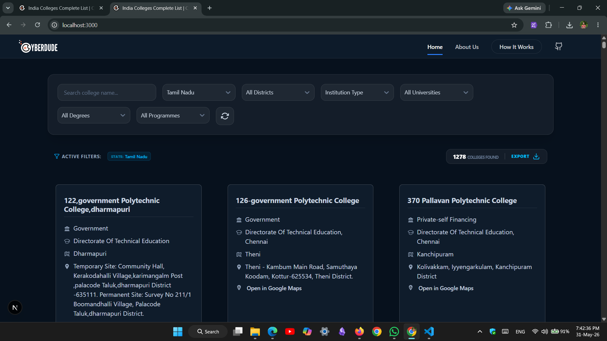
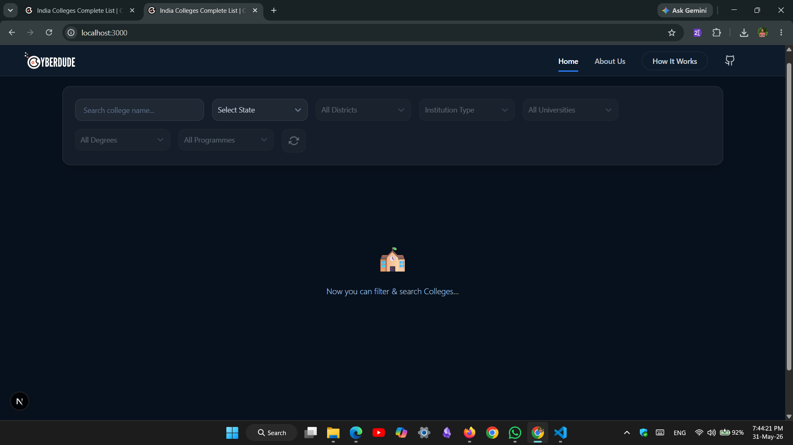
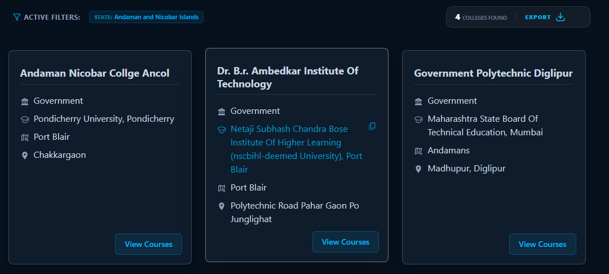
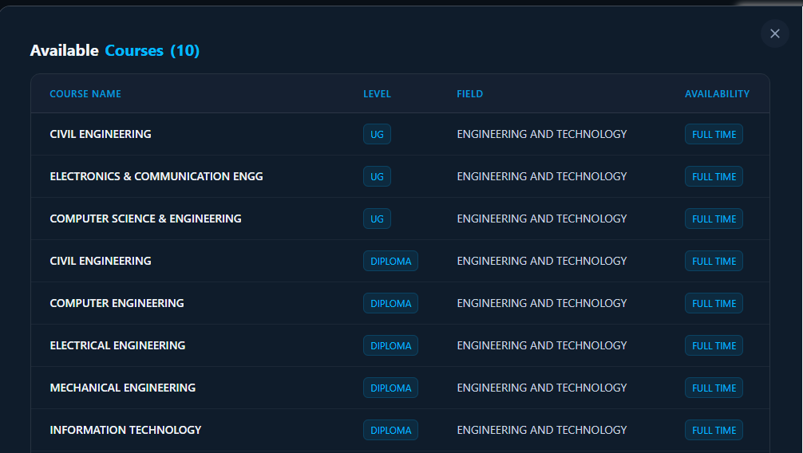
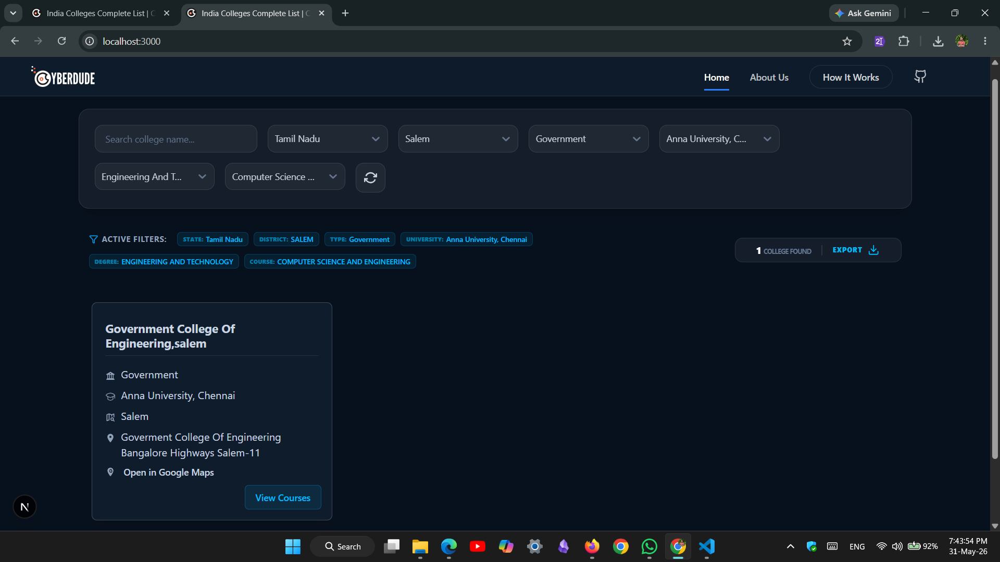
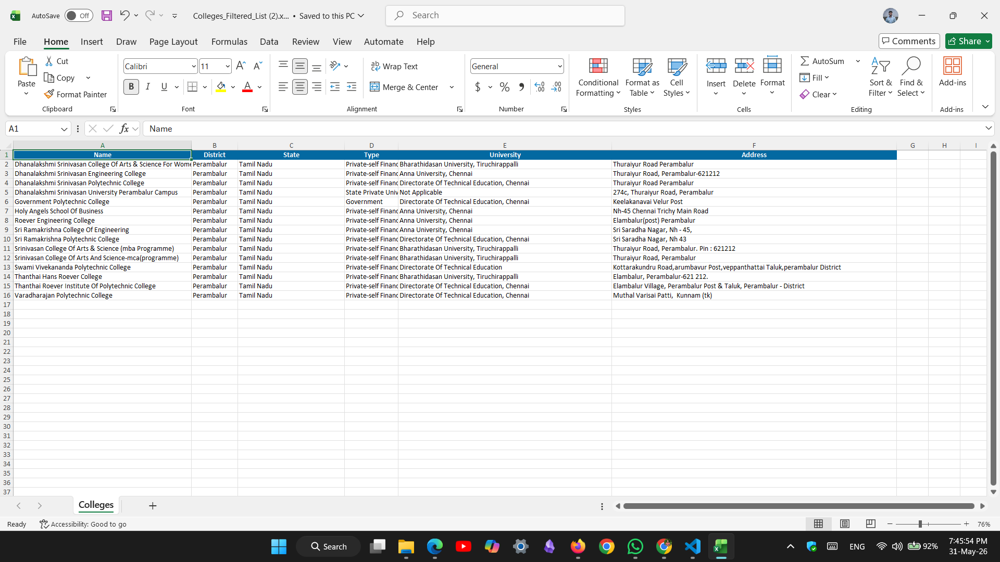
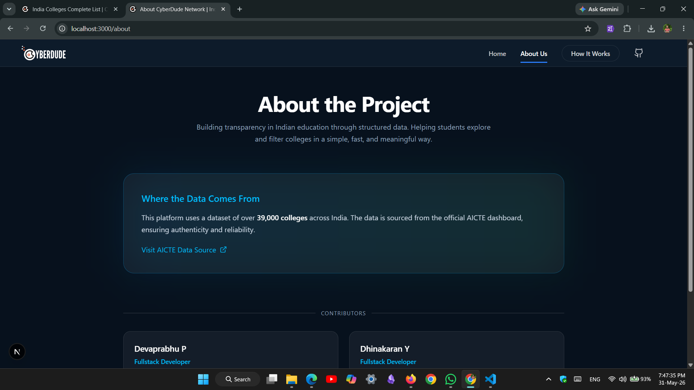
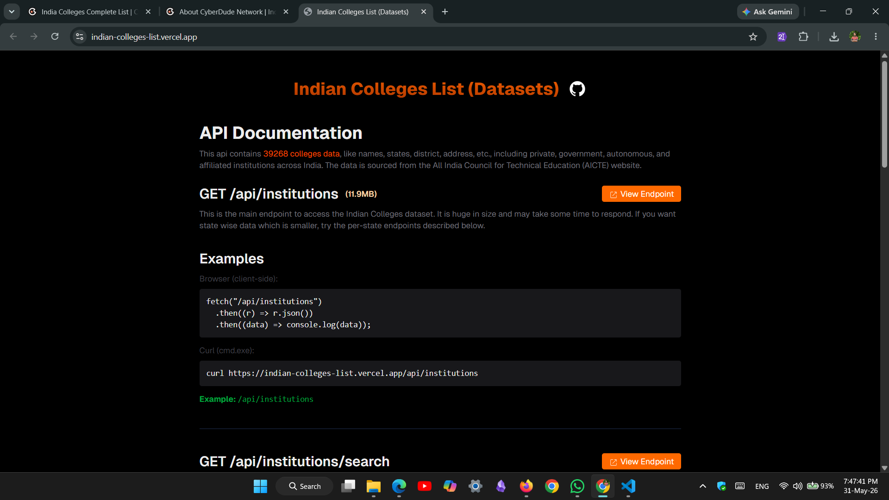

# 🎓 India Colleges Explorer

A fast, filterable web platform to search and explore **39,000+ Indian colleges** sourced from the official AICTE dashboard. Built with Next.js and React.

⭐ Live Preview: [https://college-api-nextjs-lyart.vercel.app/](https://college-api-nextjs-lyart.vercel.app/) 🪴




---

## ✨ Features

- **Auto-location Detection** — Automatically selects the user's state on first load using IP geolocation
- **Google Maps Integration** — Open any college location in Google Maps with a single click
- **Export to Excel** — Download the current filtered results as a styled `.xlsx` file
---

## 🖼️ Screenshots

**Home**




**College Cards**


**Course Dialog**


**Filtered Colleges**


**Downloaded Excel sheet**



**About**


**Api Documentation**

---

## 🛠️ Tech Stack

| Layer | Technology |
|---|---|
| Framework | [Next.js 15](https://nextjs.org/) |
| UI Library | [React 19](https://react.dev/) |
| Styling | [Tailwind CSS v4](https://tailwindcss.com/) |
| Icons | [Lucide React](https://lucide.dev/) |
| Select Inputs | [React Select](https://react-select.com/) |
| Notifications | [React Toastify](https://fkhadra.github.io/react-toastify/) |
| Excel Export | [ExcelJS](https://github.com/exceljs/exceljs) + [FileSaver.js](https://github.com/eligrey/FileSaver.js) |
| Data API | [Indian Colleges List API](https://indian-colleges-list.vercel.app/api) |

---

## 🚀 Getting Started

### Prerequisites

- Node.js 18+
- npm or yarn

### Installation

#### Clone the repository

```bash
git clone https://github.com/anburocky3/indian-colleges-data-ui.git
cd college-api-nextjs
```

#### Install dependencies
```
npm install
```

### Development

```bash
npm run dev
```

Open [http://localhost:3000](http://localhost:3000) in your browser.

### Production Build

```bash
npm run build
```
```
npm run start
```
---

## 🔌 API Reference

This project consumes the public **[Indian Colleges List (Datasets)](https://indian-colleges-list.vercel.app/)**:


---


## 👥 Contributors

| Name | Role | Links |
|---|---|---|
| Devaprabhu P | Fullstack Developer | [GitHub](https://github.com/deva-p-stack) · [LinkedIn](https://linkedin.com/in/deva-web) |
| Dhinakaran Y | Fullstack Developer | [GitHub](https://github.com/dhinakaran-Y) · [LinkedIn](https://linkedin.com/in/dhinakaran-laran) |

---

## 👤 Author

**Anbuselvan Annamalai** — [anbuselvan-annamalai.com](https://anbuselvan-annamalai.com/)

---

## 📄 License

This project is private. All rights reserved.
